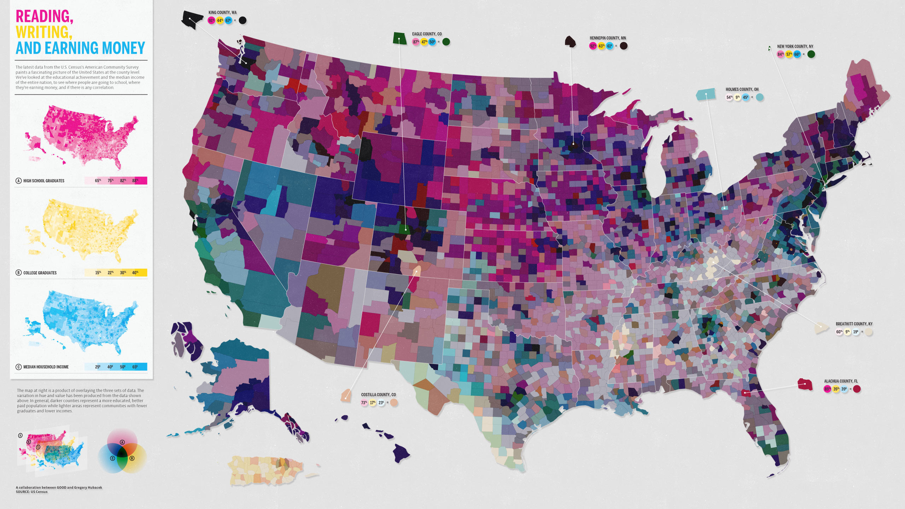

:::::::::::::::::::::::::::::::::::::: questions

- Who is the primary audience for your map?
- What message or story are you trying to communicate?
- Which data attributes are most important to show?
- How will your audience interpret or react to your map?
- What medium will your map be presented in (web, print, presentation)?
- Will your map be used to inform decisions?
- What does your audience already know, and what do they need explained?
- Do you need more data to support your map?
- Do you fully understand the topic you are mapping?

::::::::::::::::::::::::::::::::::::::::::::::::

::::::::::::::::::::::::::::::::::::: objectives

- Identify the purpose and audience of a map
- Choose appropriate data and variables to visualize
- Design maps that communicate clearly and accurately
- Evaluate whether additional data or research is needed
- Apply a checklist-based approach to cartographic design

::::::::::::::::::::::::::::::::::::::::::::::::

## Why Thoughtful Map Design Matters

Maps are powerful tools for communication. A well-designed map can reveal patterns, support decisions, and tell compelling stories. A poorly designed map can mislead, confuse, or hide important insights.

Before making a map, it’s essential to ask the right questions.

---

## 1. Know Your Audience

Your audience determines everything about your map.

### Ask yourself:
- Are they experts, policymakers, or the general public?
- What is their familiarity with maps and your topic?
- What level of detail is appropriate?

### Example:
- **General audience** → simple labels, clear legend, minimal jargon  
- **Scientific audience** → more detail, precise scales, technical terminology  

::::::::::::::::::::::::::::::::::::: callout

### Key Idea
A map for scientists and a map for the public should *not* look the same.

::::::::::::::::::::::::::::::::::::::::::::::::

---

## 2. Define Your Message

Every map should answer a clear question.

### Ask yourself:
- What is the single most important takeaway?
- Are you showing patterns, comparisons, or changes over time?

### Avoid:
- Trying to show too many variables at once
- Making the user "figure it out" without guidance

### Good Example:
> "This map shows areas at highest risk of flooding."

---

## 3. Choose the Right Data Attributes

Not all data belongs on your map.

### Ask yourself:
- Which variable is most important?
- Are there supporting variables (e.g., population, elevation)?
- Is your data spatially appropriate (points, lines, polygons)?

### Tips:
- Use **color** for magnitude (e.g., rainfall)
- Use **size** for comparison (e.g., population)
- Use **symbols** for categories (e.g., land use)

::::::::::::::::::::::::::::::::::::: challenge

### Quick Check
You have temperature, precipitation, and elevation data.  
Which one would you prioritize if your goal is to show drought risk?

::::::::::::::::::::::::::::::::::::::::::::::::

---

## 4. Consider Audience Perception

Maps are not neutral — design choices influence interpretation.

### Ask yourself:
- Could colors be misleading (e.g., red = danger)?
- Are you introducing bias unintentionally?
- Is the map easy to interpret at a glance?

### Example:
- Dark colors may imply higher importance
- Certain color schemes may exclude colorblind users

---

## 5. Choose the Right Medium

Where your map is displayed affects design decisions.

### Common mediums:
- **Web maps** → interactive, zoomable
- **Print maps** → static, high resolution
- **Presentations** → simple, bold visuals

### Ask yourself:
- Will users zoom in?
- Will the map be printed in black and white?
- How large will it appear?

---

## 6. Will Your Map Inform Decisions?

Some maps are purely exploratory, while others guide real-world actions.

### Decision-making maps should:
- Be highly accurate
- Include uncertainty (if possible)
- Avoid misleading simplifications

### Example:
- Flood risk maps used by city planners
- Public health maps used during outbreaks

::::::::::::::::::::::::::::::::::::: callout

### Important
If your map influences decisions, accuracy and clarity are critical.

::::::::::::::::::::::::::::::::::::::::::::::::

---

## 7. Understand Your Audience’s Knowledge

### Ask yourself:
- Do they understand your variables?
- Do you need to explain units or scales?
- Should you include annotations or context?

### Tips:
- Add legends and labels
- Use plain language when possible
- Provide context (e.g., time period, data source)

---

## 8. Do You Need More Data?

Incomplete data can lead to misleading maps.

### Ask yourself:
- Are there missing variables that affect interpretation?
- Is your data up to date?
- Is the spatial resolution sufficient?

### Example:
Mapping income without population density may mislead conclusions.

---

## 9. Do You Understand Your Data?

Before mapping, you should fully understand your dataset.

### Ask yourself:
- What does each variable represent?
- Are there biases or limitations?
- Have you explored the data (e.g., summary statistics)?

### If not:
- Perform exploratory data analysis (EDA)
- Read metadata and documentation
- Consult domain experts if needed

---

## Cartography Checklist (Summary)

Before finalizing your map, review this checklist:

- [ ] I know my target audience
- [ ] My map has a clear purpose/message
- [ ] I selected the most relevant data
- [ ] My design avoids misleading interpretations
- [ ] The map fits its intended medium
- [ ] The map is appropriate for decision-making (if applicable)
- [ ] I accounted for audience knowledge level
- [ ] My dataset is complete and appropriate
- [ ] I fully understand the data and topic

---

## Final Thought

A good map is not just visually appealing — it is **honest, clear, and purposeful**.

::::::::::::::::::::::::::::::::::::: discussion

- Think of a map you’ve seen recently.  
  What did it do well? What could be improved?

- How might the same data be presented differently for another audience?

::::::::::::::::::::::::::::::::::::::::::::::::