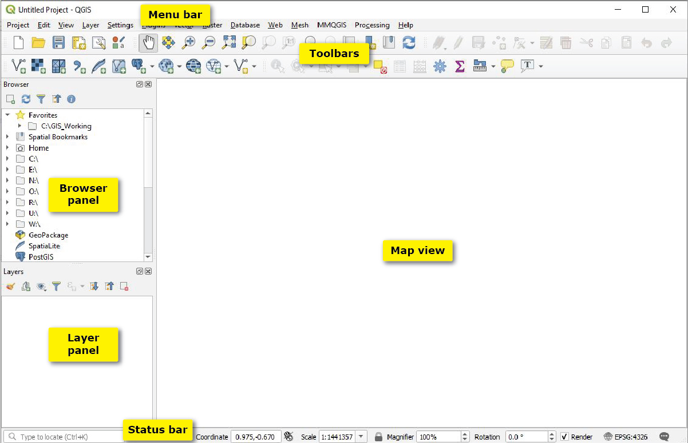

:::::::::::::::::::::::::::::::::::::: questions

- What is QGIS and why is it useful?
- How do I install QGIS on my system?
- How do I load spatial data into QGIS?
- How can I style and visualize data on a map?
- How do I export a finished map?

::::::::::::::::::::::::::::::::::::::::::::::::

::::::::::::::::::::::::::::::::::::: objectives

- Install QGIS successfully
- Understand the QGIS interface
- Load and explore spatial datasets
- Create and style a simple map
- Export a publication-ready map

::::::::::::::::::::::::::::::::::::::::::::::::

## What is QGIS?

**QGIS** is a free, open-source Geographic Information System (GIS) used to:
- Visualize spatial data
- Analyze geographic patterns
- Create professional-quality maps

::::::::::::::::::::::::::::::::::::: callout

### Why QGIS?
QGIS is widely used in academia, industry, and government — and it's completely free.

::::::::::::::::::::::::::::::::::::::::::::::::

---

## Installing QGIS

### Step 1: Download QGIS

1. Go to the official QGIS website:  
   👉 https://qgis.org

2. Click **Download Now**

3. Choose the appropriate version:
   - **Windows** → Use the *Standalone Installer*
   - **Mac** → Download the macOS package
   - **Linux** → Install via package manager (apt, yum, etc.)

---

### Step 2: Install QGIS

- Run the installer
- Keep default settings (recommended for beginners)
- Wait for installation to complete

---

### Step 3: Launch QGIS

- Open QGIS Desktop
- You should see the main interface

---

## Understanding the QGIS Interface

### Key Components:

- **Map Canvas** → where your map is displayed  
- **Layers Panel** → shows all loaded datasets  
- **Browser Panel** → access files on your system  
- **Toolbar** → tools for navigation and editing  

::::::::::::::::::::::::::::::::::::: callout

### Tip
If a panel is missing, enable it via:  
**View → Panels**

::::::::::::::::::::::::::::::::::::::::::::::::

---

## Loading Your First Dataset

We will start with a simple dataset (e.g., shapefile or GeoJSON). You can find a sample dataset [here](https://github.com/qgis/QGIS-Sample-Data/tree/master/qgis_sample_data)

For our example, we will use `airport.shp` in the shapefiles folder in the link. Along with the .shp file make sure to download its supporting files to load in the .shp correctly. They are:

- airports.cpg
- airports.dbf
- airports.prj
- airports.shx

### Step 0: Add Base Map

1. In the Browser Panel click on `XYZ Tiles`. 
2. You should see 2 options: Global Terrain and Open Street Map. 
3. Right click on Open Street Map and Add Layer to Project.
4. You should now see a world map on you Map Panel. 

### Step 1: Add a Vector Layer

1. Go to: **Layer → Add Layer → Add Vector Layer**. Since we are working with point data here. 
2. Browse to your dataset
3. Click **Add** or double click on the file. 
4. (If Applicable), drag the airports layer above the Open Street Map Layer since you want the points on top of the world map. 

---

### Step 2: View the Data

- Your data will appear on the map
- The layer will show in the **Layers Panel**

---

### Step 3: Explore Attributes

1. Right-click the layer
2. Click **Open Attribute Table**
3. You should see 76 entries for number of airports in Alaska.

This table contains the data behind your map.

---

## Styling Your First Map

### Step 1: Open Layer Properties

- Right-click the layer → **Properties**
- Go to the **Symbology** tab

---

### Step 2: Choose a Style

### Common styling options:

- **Single Symbol** → same style for all features  
- **Categorized** → different colors for categories  
- **Graduated** → color ramp for numeric data  

---

### Step 3: Apply Colors (Applicable if working with a lot more data like elevation, climate data)

- Try downloading the `elevp` file in csv folder
- Choose a color ramp
- Adjust classes (for graduated maps)
- Click **Apply**

---

## Adding a Basemap (Optional)

Basemaps provide geographic context.

### Option: Use XYZ Tiles

1. In Browser Panel → Right-click **XYZ Tiles**
2. Select a source (e.g., OpenStreetMap)
3. Drag it into the map

---

## Creating a Map Layout

To export your map, use the **Print Layout**.

### Step 1: Open Layout

- Go to: **Project → New Print Layout**
- Give it a name

---

### Step 2: Add Map

- Click **Add Map**
- Draw a rectangle on the page

---

### Step 3: Add Map Elements

::contentReference[oaicite:2]{index=2}

Include:
- **Title**
- **Legend**
- **Scale Bar**
- **North Arrow**

---

## Exporting Your Map

### Step 1: Export

- In layout window:
  - **Export as PNG**
  - **Export as PDF**

### Step 2: Save Your Project

- Always save your QGIS project file (`.qgz`)

---

## Common Beginner Mistakes

- Forgetting to save the project
- Using raw counts instead of normalized data
- Overcomplicating symbology
- Ignoring legends and labels

::::::::::::::::::::::::::::::::::::: callout

### Keep It Simple
Start with a clear, simple map before adding complexity.

::::::::::::::::::::::::::::::::::::::::::::::::

---

## Hands-On Exercise

### Task:
Create a choropleth map showing a variable of your choice.

### Steps:
1. Load a dataset
2. Open Symbology → Graduated
3. Choose a numeric field
4. Apply a color ramp
5. Export the map

---

## Final Takeaways

- QGIS is a powerful, free tool for spatial analysis
- Good maps start with clean data and simple design
- Symbology and layout are key to communication

::::::::::::::::::::::::::::::::::::: discussion

- What challenges did you face while creating your first map?
- How would you improve your map for a different audience?

::::::::::::::::::::::::::::::::::::::::::::::::